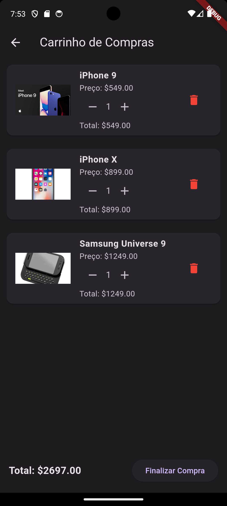

# E-Shop App

O E-Shop App é uma aplicação de compras desenvolvida em Flutter.
<div style="display: flex; flex-wrap: wrap;">
  
  
  
  
</div>

## Funcionalidades Principais

- Navegação entre a tela inicial, carrinho de compras, favoritos e detalhes do produto.
- Adicionar e remover produtos do carrinho de compras.
- Visualizar o total do carrinho de compras.
- Alternar entre temas claro e escuro.
- Detalhes do produto com imagem, preço, marca e descrição.
- Botões para aumentar e diminuir a quantidade de itens no carrinho.

## Pré-requisitos

- Flutter instalado (versão 3.13.6).
- Git instalado.

## Instalação

1. Clone este repositório:

```bash
git clone https://github.com/seu-usuario/e-shop-app.git
